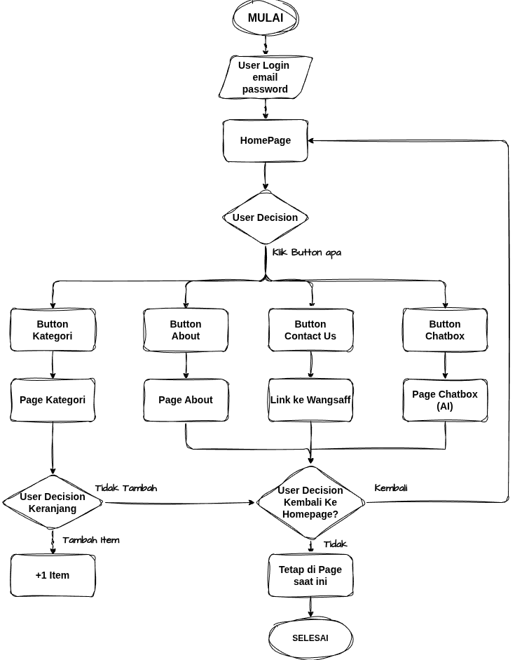

# STATtion
<b>Statistika Bisnis 2A 
PROJECT ETS WEBPRO</b> 
 
Dosen: Abdillah Nafis., S.Stat, M.MT. 
Asisten Dosen: I Kadek Dewangga Nayakadana 
 
Anggota Kelompok 10: 
- Naila Dzulfa (046) 
- Ikhwan Nur Sya'bani (048) 
- Hanida Hafsya Tsabita (056) 
- Grace Nathalie Diandra C. W. (060) 
- Rizki Ritama (062) 
 
<i>Link PPT: https://www.canva.com/design/DAHGyIxrBCc/47lQRVXOQPs28gcml2KCbw/edit</i> 
<i>Link OVERVIEW WEB: https://ndzull.github.io/ETSWEBPROKELOMPOK10/</i> 
<h2>APA ITU STATtion?</h2>
STATtion adalah sebuah aplikasi berbasis web yang dirancang untuk memberikan fasilitas informasi tentang kebutuhan mahasiswa statistika. Website ini menyediakan berbagai informasi apa saja yang dibutuhkan oleh mahasiswa Statistika, seperti buku apa yang diperlukan untuk mata kuliah tertentu, apa saja alat-alat atau software yang digunakan dan lainnya. Dengan adanya STATtion, diharapkan mahasiswa dapat dengan mudah mengakses informasi yang mereka butuhkan untuk menunjang pembelajaran mereka di bidang statistika. 
 
<h2>FLOWCHART</h2>

<h2>JOBDESK CHECKLIST</h2>
Loginpage: kiki (aman) 
Homepage 
- header: ijul (aman) 
- section 1 ikhwan (aman) 
- section 2 ikhwan (aman) 
- section 3 ijul (aman) 
- section 4 ijul (aman) 
- footer: ikhwan (aman) 
Aboutpage : Hani (aman) 
Kategoripage : grace (aman) 
Chatbox section : ijul (aman) 
Yang nyatuin: ijul (aman) 

<h2>Yang perlu dibenahin buat finishing:</h2>
- masih ada beberapa section yang responsifnya berantakan (section 1 homepage)
- beresin navbar di page kategori (anomali jir)
- nyari cara push full github tanpa bagian api key (chatbox) ke hide

<h2>Path file</h2>
<code>
├── aboutpage.html --> halaman about
├── assets --> Isinya gambar-gambar yang digunakan di website
├── category.html --> halaman kategori
├── draft --> Isinya beberapa draft kodingan dari masing-masing anggota polosan
├── index.html --> homepage
├── loginpage.html --> halaman login
├── main.js --> file js website
├── README.md
└── style.css --> file css website</code>